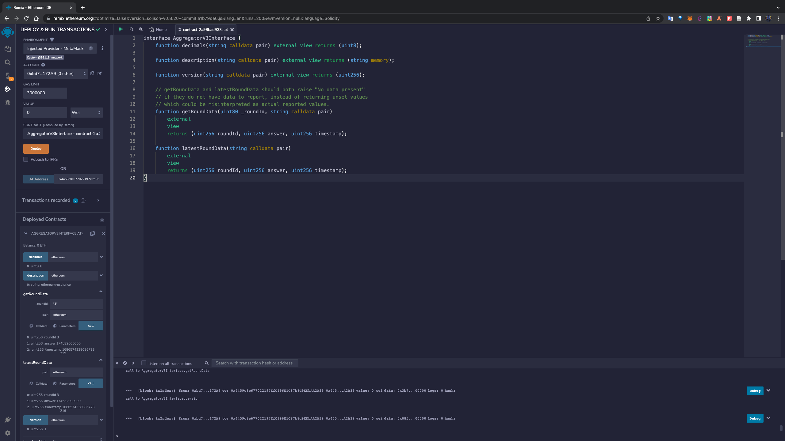

# Oracle canister

## build
```sh
cargo run -p oracle_canister --features "export-api" > ./.artifact/oracle_canister.did

cargo build --target wasm32-unknown-unknown --release --package oracle_canister --features "export-api"

ic-wasm target/wasm32-unknown-unknown/release/oracle_canister.wasm -o ./.artifact/oracle_canister.wasm shrink
```

## deploy local
terminal 0:
```sh
dfx start --clean
```

terminal 1:
```sh
dfx canister create --no-wallet oracle_canister

dfx build oracle_canister

dfx canister install oracle_canister --argument "record { evmc_principal=principal \"aaaaa-aa\";owner=principal \"$(dfx identity get-principal)\"}"

# add cryptocurrency pairs
dfx canister call oracle_canister add_pair '("bitcoin")'
dfx canister call oracle_canister add_pair '("ethereum")'
dfx canister call oracle_canister add_pair '("internet-computer")'
dfx canister call oracle_canister add_pair '("ordinals")'
dfx canister call oracle_canister add_pair '("dfuk")'
dfx canister call oracle_canister add_pair '("pepebrc")'
dfx canister call oracle_canister add_pair '("pizabrc")'
dfx canister call oracle_canister add_pair '("biso")'
dfx canister call oracle_canister add_pair '("meme-brc-20")'
```

Open link: `http://127.0.0.1:8000/?canisterId=<Oracle_Canister_Id>` such as `http://127.0.0.1:8000/?canisterId=bnz7o-iuaaa-aaaaa-qaaaa-cai` in browser. 

## work with test evmc

Open link: [oracle canister](https://p6xvw-7iaaa-aaaap-aaana-cai.raw.ic0.app/) in browser. 

The `Aggregator` contract address in EVM canister is `0x4459c8e677022197efc196e1c87b8d9edbaa2a39`.

here is the deploy details:
```sh
dfx build oracle_canister --network ic

dfx canister install oracle_canister --argument "record { evmc_principal=principal \"4fe7g-7iaaa-aaaak-aegcq-cai\";owner=principal \"$(dfx identity get-principal)\"}" -m=upgrade --network ic


# add supported cryptocurrencies
dfx canister call oracle_canister add_pair '("bitcoin")' --network ic
dfx canister call oracle_canister add_pair '("ethereum")' --network ic
dfx canister call oracle_canister add_pair '("internet-computer")' --network ic
dfx canister call oracle_canister add_pair '("ordinals")' --network ic
dfx canister call oracle_canister add_pair '("dfuk")' --network ic
dfx canister call oracle_canister add_pair '("pepebrc")' --network ic
dfx canister call oracle_canister add_pair '("pizabrc")' --network ic
dfx canister call oracle_canister add_pair '("biso")' --network ic
dfx canister call oracle_canister add_pair '("meme-brc-20")' --network ic

# ... the canister will get the price pair automatically

# get evm canister id
dfx canister call oracle_canister get_evmc_principal --network ic --query
(principal "4fe7g-7iaaa-aaaak-aegcq-cai")

dfx canister id oracle_canister --network ic
p6xvw-7iaaa-aaaap-aaana-cai

# we registry 0xe49f07de45ae4333a6d70f097501f4a4b7dab0a5 for oracle canister in evmc
# check is_address_registered
dfx canister --network ic call evmc is_address_registered '("0xe49f07de45ae4333a6d70f097501f4a4b7dab0a5", principal "p6xvw-7iaaa-aaaap-aaana-cai")' --query
(false)

dfx canister --network ic call oracle_canister get_self_address_in_evmc --query
(variant { Err = variant { Internal = "Account no registered yet" } })

dfx canister --network ic call oracle_canister register_self_in_evmc '(record {r="0x6e66f522e38b1dfa39ddffcea14f29ddcc6578c7f74fae43dedc30e718cb6ac3";s="0x34bae6555dd4ec275f80898931e3559158790bb999b8242037512e232c4ddf11";v="0xad676";to=opt "0xb0e5863d0ddf7e105e409fee0ecc0123a362e14b";gas="0x5208";maxFeePerGas=null;gasPrice=opt "0xa";value="0x186a0";blockNumber=null;from="0xe49f07de45ae4333a6d70f097501f4a4b7dab0a5";hash="0x6944a74c0fa7d81c8b1f4d4a925f096c045d2dca0fa7c16246916963dd88b71d";blockHash=null;"type"=null;accessList=null;transactionIndex=null;nonce="0x0";maxPriorityFeePerGas=null;input="";chainId=opt "0x56b29"}, vec {162:nat8;62:nat8;47:nat8;13:nat8;71:nat8;239:nat8;148:nat8;14:nat8;161:nat8;184:nat8;41:nat8;139:nat8;136:nat8;208:nat8;92:nat8;34:nat8;152:nat8;57:nat8;9:nat8;92:nat8;46:nat8;9:nat8;159:nat8;219:nat8;250:nat8;90:nat8;77:nat8;182:nat8;231:nat8;233:nat8;101:nat8;60:nat8})'
(variant { Ok })

dfx canister --network ic call evmc is_address_registered '("0xe49f07de45ae4333a6d70f097501f4a4b7dab0a5", principal "p6xvw-7iaaa-aaaap-aaana-cai")' --query
(true)

dfx canister --network ic call oracle_canister get_self_address_in_evmc --query
(variant { Ok = "0xe49f07de45ae4333a6d70f097501f4a4b7dab0a5" })

dfx canister --network ic call evmc account_basic '("0xe49f07de45ae4333a6d70f097501f4a4b7dab0a5")' --query
(record { balance = "0x3b960f10"; nonce = "0x1" })

# deploy AggregatorSingle in evmc
dfx canister --network ic call oracle_canister deploy_aggregator_contract
(
  variant {
    Ok = "0xa49232951f5b790e8d952d98be7bb2ac6d0d8ba6899bfd4c079abebee5c48c6e"
  },
)

# we can see https://explorer.bitfinity.network/tx/0xa49232951f5b790e8d952d98be7bb2ac6d0d8ba6899bfd4c079abebee5c48c6e

dfx canister --network ic call evmc eth_get_transaction_receipt '("0xa49232951f5b790e8d952d98be7bb2ac6d0d8ba6899bfd4c079abebee5c48c6e")' --query
(
  variant {
    Ok = opt record {
      to = null;
      status = opt "0x1";
      output = opt blob "...";
      transactionHash = "0xa49232951f5b790e8d952d98be7bb2ac6d0d8ba6899bfd4c079abebee5c48c6e";
      cumulativeGasUsed = "0x0";
      blockNumber = "0x4db";
      from = "0xe49f07de45ae4333a6d70f097501f4a4b7dab0a5";
      logs = vec {};
      blockHash = "0xa147112e16baa2185be3d1c401c2bd9697b5492a51651c36480da6df099896a9";
      root = null;
      "type" = null;
      transactionIndex = "0x0";
      effectiveGasPrice = null;
      logsBloom = "0x00000000000000000000000000000000000000000000000000000000000000000000000000000000000000000000000000000000000000000000000000000000000000000000000000000000000000000000000000000000000000000000000000000000000000000000000000000000000000000000000000000000000000000000000000000000000000000000000000000000000000000000000000000000000000000000000000000000000000000000000000000000000000000000000000000000000000000000000000000000000000000000000000000000000000000000000000000000000000000000000000000000000000000000000000000000";
      contractAddress = opt "0x4459c8e677022197efc196e1c87b8d9edbaa2a39";
      gasUsed = opt "0x11589b";
    }
  },
)

# confirm aggregator deployed successfully
dfx canister --network ic call oracle_canister confirm_aggregator_contract
(variant { Ok = "0x4459c8e677022197efc196e1c87b8d9edbaa2a39" })

dfx canister --network ic call oracle_canister get_aggregator_contract_address
(variant { Ok = "0x4459c8e677022197efc196e1c87b8d9edbaa2a39" })

dfx canister --network ic call oracle_canister add_pair_in_aggregator '("bitcoin", "0x8", "bitcoin-usd price", "0x1")'
(
  variant {
    Ok = "0x7b21ec13a2aa406bca6147e1f08f13d40fac268fe74fa638b7bfabdf484a82a5"
  },
)
# https://explorer.bitfinity.network/tx/0x7b21ec13a2aa406bca6147e1f08f13d40fac268fe74fa638b7bfabdf484a82a5

dfx canister --network ic call oracle_canister add_pair_in_aggregator '("ethereum", "0x8", "ethereum-usd price", "0x1")'
(
  variant {
    Ok = "0x48f63d5a3598fa3def9992b9360f250a59c835b8c3bd61f5b3927fa532f5a2c1"
  },
)

dfx canister --network ic call oracle_canister add_pair_in_aggregator '("internet-computer", "0x8", "icp-usd price", "0x1")'
(
  variant {
    Ok = "0x3a7bf3e63fa63b2aff6300746ae7478332b7b0464ea4685d2c61bdeb7f66d23c"
  },
)

dfx canister --network ic call oracle_canister add_pair_in_aggregator '("ordinals", "0x8", "ord-usd price", "0x1")'
(
  variant {
    Ok = "0x101885cf854a82b35b4c795b2bf07da53d8e233c043f32aea8334db2ed7a6f77"
  },
)

dfx canister --network ic call oracle_canister add_pair_in_aggregator '("dfuk", "0x8", "dfuk price", "0x1")'
(
  variant {
    Ok = "0x4d144d37475b60f9498312d62923fb1550223d293fb34777c36ea6879ca8e54b"
  },
)

dfx canister --network ic call oracle_canister add_pair_in_aggregator '("pepebrc", "0x8", "pepebrc-usd price", "0x1")'
(
  variant {
    Ok = "0xe24fdb0ce62b91594b3451052baa86128e8702beec97627232c5ac96421a041e"
  },
)

dfx canister --network ic call oracle_canister add_pair_in_aggregator '("pizabrc", "0x8", "pizabrc-usd price", "0x1")'
(
  variant {
    Ok = "0x35fa4a66f9d3ba1401e8c134c3c8fb3efde78ca29e082767fee00ed8ef037133"
  },
)
dfx canister --network ic call oracle_canister add_pair_in_aggregator '("biso", "0x8", "biso-usd price", "0x1")'
(
  variant {
    Ok = "0x471973a6a961acd272c0a6bcc42e6e01c1d0d76fdeddf961b240e2a4b0af46f0"
  },
)

dfx canister --network ic call oracle_canister add_pair_in_aggregator '("meme-brc-20", "0x8", "meme(brc)-usd price", "0x1")'
(
  variant {
    Ok = "0x4364277a2f79ab095f81b3c4a2a12ca2819ed3c4852947f22bbe0faf609d3c32"
  },
)

dfx canister --network ic call oracle_canister update_answers '(vec {"bitcoin"},vec {"0x1767D7FA49F0534F"},vec {"0x259FBCF1F00"})'
(
  variant {
    Ok = "0x7b21ec13a2aa406bca6147e1f08f13d40fac268fe74fa638b7bfabdf484a82a5"
  },
)

dfx canister --network ic call oracle_canister update_answers '(vec {"ethereum";"internet-computer";"ordinals";"dfuk";"pepebrc"},vec {"0x1767E90EF6FF5509";"0x1767E90EF6FF5509";"0x1767E90EF6FF5509";"0x1767E90EF6FF5509";"0x1767E90EF6FF5509"},vec {"0x289C6BC3C0";"0x15DFF9C0";"0x1E477700";"0xD0DACC0";"0x0"})'
(
  variant {
    Ok = "0x8d473fe147bec1c917239d186ac2005926159cdb18cb0823427f4513b0d90efc"
  },
)


dfx canister --network ic call oracle_canister update_answers '(vec {"pizabrc";"biso";"meme-brc-20"},vec {"0x1767E90EF6FF5509";"0x1767E90EF6FF5509";"0x1767E90EF6FF5509";},vec {"0x750698";"0xB3CFC";"0x7866C100"})'
(
  variant {
    Ok = "0x2a2ce0056275cd92d260a39c675b1b903a9035192fcb9afb303ed4888e877309"
  },
)

# since all functions work, we start the timer to feed price automatically:
dfx canister --network ic call oracle_canister start_feed_price_timer
()
```

## check the contract

First switch the `Metamask` network to `Bitfinity`, for details, please refer to [docs](https://tech-docs-evmc.vercel.app/interact/metamask#connecting-metamask-to-the-bitfinity-evm).

Then we go to [remix](https://remix.ethereum.org/) copy [AggregatorV3Interface](./solidity/src/AggregatorSingle.sol) in, then compile, and finally enter `DEPLOY & RUN TRANSACTIONS`, select `Injected Provider-Metamask` for `ENVIRONMENT`, paste the oracle contract address `0x4459c8e677022197efc196e1c87b8d9edbaa2a39` to `At Address`, click `At Address`, you can get direct query interface:

